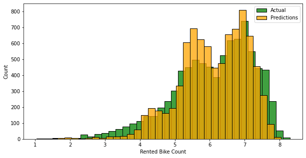

# Capstone-Project-AcademyXi


# Analysis for BT Seoul Bike Rental Service in Seoul, South Korea

**Author:** Yessy Rayner
***

## Business Overview
Since COVID-19 pandemic, bike rental businesses in Seoul are booming. This is an unexpected result for BT Seoul Bike Hire, so they would like some analysis on:

- How many extra staff members require during busy period. It is estimated by the management that 1 staff member required to service every 200 bikes/customers
- Quiet time of the day, so they can service their bikes with less disruption. They are currently close 1 day per month to service their bikes
- BT Seoul Bike Hire also would like to expand their business to other major metropolitan cities such as Busan and Incheon using the same business model and staffing method.

## Data Understanding and Preparation
The dataset contains rented bike count at each hour with the corresponding weather data and date information for the six months period (From March to October 2018). In total there are 7890 rented bike data counts with 10 features, which being grouped as follow for the testing and validation:

- Base variables: Temperature (C), Dewpoint (C), Solar radiation (MJ/m2) due to apparent linear relationship
- Continuous variables: Humidity (%), Windspeed (m/s), Visibility (10m), Snowfall (cm) and Rainfall (mm)
- Discrete variables: Date and Hour
- Categorical variables: Seasons and Holiday

Here are some of the data preprocessing and cleaning methods being performed:

- Checked if all data are in correct data types
- Checked any missing data
- Added 2 additional categorial variables: Day_of_week (Monday to Sunday) and Shift (Early morning, Morning peak, Mid day, Evening peak) – This will help with predicting the staffing requirements
- Drop ‘Functioning Day = No’ (Close down due to bike servicing day), removed the ‘No’ value as it skews the overall data.

## Modelling & Regression Results
Using linear regression model to predict bike rental per hour or shift based on numerous features/variables.

Here are some of the methods being performed and tested using combinations of variables as well as other validation and transformation:
- Cross validation - where data being split into train and test data (75/25 split)
- Testing on different variables/models based on:
- Model 1: Base variables (R2 at 0.432)
- Model 2: Base + continuous variables (R2 at 0.508)
- Model 3: Base + continuous + discrete variables (R2 at 0.574)
- Model 4: Recursive Features Elimination (6 Features at 0.564 & 8 features at 0.573)
- Model 5: ALL variables including categorial variables after being transformed using OneHotEncoder (R2 at 0.661)
- Popular Transformation methods performed in order to get the best fit, such as Logarithm, Min-Max Scaling, Standard Scaling, Polynomial-Interaction (R2 at 0.707)


Here are some graphs for comparison (Base Model vs. Final Model):


Plotting data against predictions/final model to check on the accuracy: (Pretty good result!)



## Conclusion

Looking at the positive coefficient, I am able to identify the most important features in this model, which are:
- Temperature
- Humidity
- Visibility
- ALL of the categorical variables (Day of Week, Seasons, Shift)

## Next Steps

In order to get more accurate prediction model, I suggest:
- Gather more bike rental data especially post COVID-19 period, ideally throughout 2022
- Try to incorporate Random Forest Regression which might work well with the Bike Rental data. As Random Forest Regression is a prediction model based on the trees structure and it takes into account of many predictions and use the average value. These algorithms are more stable because any changes in dataset can impact one tree but not the forest of trees.

## Limitation

- Some datasets aren't suitable for Linear Regression 
- R-squared score of 0.707 is not perfect despite numerous models and transformation being tested 
- However, 0.707 is pretty good score especially in predicting human behaviour (Weather vs. No of bikes rented)
- In business/staffing modelling, 0.707 is adequate as it provides moderate linear relationship

## For More Information

See the full analysis in the [[Jupyter Notebook](./Yessy Capstone_Project.ipynb)]

For additional info, contact Yessy Rayner at [yessy.rayner@gmail.com](mailto:yessy.rayner@gmail.com)

## Repository Structure

```
├── image
├── README.md 
├── SeoulBikeData.csv
├── Yessy Capstone - Bike Rental Analysis for BT Seoul Bike Hire Presentation.pdf
├── Yessy_Capstone_Project - Jupyter Notebook PDF.pdf
└── Yessy_Capstone_Project.ipynb
